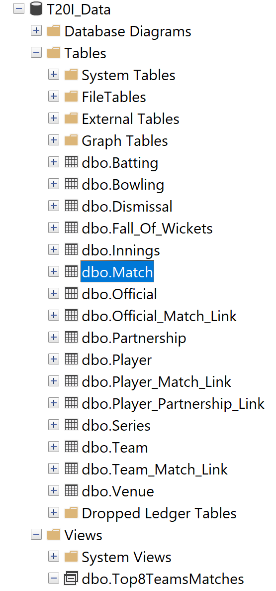

# 🏏 Cricket Database & Analysis Project  

## 📌 Overview  
This project demonstrates the **end-to-end pipeline of cricket data analysis** — starting from **unorganized Kaggle datasets**, cleaning and structuring them in **Python**, storing them in a **normalized SQL Server database (BCNF)**, and finally performing **statistical analysis and visualizations** on captains, players, and teams.  

🔗 Connect with me: [LinkedIn](https://www.linkedin.com/in/danyal-ahmad-598b87294)  

---

## 📂 Project Workflow  

### 1. Data Collection  
- Source: Kaggle cricket datasets (unstructured format).  
- Key CSVs:  
  - `players_info.csv`  
  - `t20i_Batting_Card.csv`  
  - `t20i_Bowling_Card.csv`  
  - `t20i_Matches_Data.csv`  
  - `t20i_Partnership_Card.csv`  

---

### 2. Data Cleaning (Python)  
📓 Notebook: `csvcleaningandanalysis.ipynb`  

- Removed duplicates & null values.  
- Standardized inconsistent column names.  
- Converted datatypes (dates, numerics).  
- Used **Pandas** for cleaning, **NumPy** for numerical operations.  

---

### 3. Database Design (SQL Server)  

📌 **Entity-Relationship Diagram**  
  

📜 **Schema (script.sql)**  
```sql
CREATE TABLE Players (
    Player_ID INT PRIMARY KEY,
    Player_Name VARCHAR(100),
    Country VARCHAR(50),
    Batting_Style VARCHAR(50),
    Bowling_Style VARCHAR(50)
);

CREATE TABLE Matches (
    Match_ID INT PRIMARY KEY,
    Team1_ID INT,
    Team2_ID INT,
    Venue VARCHAR(100),
    Date DATE
);

CREATE TABLE Batting_Card (
    Batting_ID INT PRIMARY KEY,
    Match_ID INT FOREIGN KEY REFERENCES Matches(Match_ID),
    Player_ID INT FOREIGN KEY REFERENCES Players(Player_ID),
    Runs INT,
    Fours INT,
    Sixes INT,
    StrikeRate FLOAT,
    Is_Out BIT
);

CREATE TABLE Bowling_Card (
    Bowling_ID INT PRIMARY KEY,
    Match_ID INT FOREIGN KEY REFERENCES Matches(Match_ID),
    Player_ID INT FOREIGN KEY REFERENCES Players(Player_ID),
    Overs FLOAT,
    Runs_Conceded INT,
    Wickets INT,
    Economy FLOAT
);
```sql
...
``` 

✔ Database normalized to BCNF with proper Primary & Foreign Keys.
---

### 4. Data Loading into SQL Server

📓 Notebook: savingtosql.ipynb

Connected Python with SQL Server using pyodbc.

Inserted cleaned CSVs into normalized tables.

---
### 5. Analysis

  

📓 Notebook: sqlloadandanalysis.ipynb

Example SQL Queries
```sql
Top Captains (Min 10 Matches)

SELECT c.Captain_Name, COUNT(m.Match_ID) AS Matches_Played, 
       SUM(CASE WHEN m.Result = 'Win' THEN 1 ELSE 0 END) AS Wins
FROM Captains c
JOIN Matches m ON c.Captain_ID = m.Captain_ID
GROUP BY c.Captain_Name
HAVING COUNT(m.Match_ID) >= 10
ORDER BY Wins DESC;


Top Batters (Total Runs & Avg SR)

SELECT p.Player_Name, SUM(b.Runs) AS Total_Runs, AVG(b.StrikeRate) AS Avg_SR
FROM Batting_Card b
JOIN Players p ON b.Player_ID = p.Player_ID
GROUP BY p.Player_Name
ORDER BY Total_Runs DESC;


Economical Bowlers (Min 40 overs & 20 wickets)

SELECT p.Player_Name, SUM(b.Wickets) AS Total_Wickets, AVG(b.Economy) AS Avg_Econ
FROM Bowling_Card b
JOIN Players p ON b.Player_ID = p.Player_ID
GROUP BY p.Player_Name
HAVING SUM(b.Overs) >= 40 AND SUM(b.Wickets) >= 20
ORDER BY Avg_Econ ASC;

```sql
...
``` 

---

### 6. Visualizations

📊 Created using Matplotlib & Seaborn.

Captains Record (Min 10 matches vs Top 8 Teams)


Batters Avg vs Strike Rate (Top 8 Teams)


Top 50 Partnerships


Bowler Economy Rates


Pakistan Performance by Venues

---

### 🚀 Key Insights

Discovered most successful captains (based on win %).

Analyzed batting efficiency → Avg vs Strike Rate.

Identified economical bowlers with consistent records.

Highlighted impact players with match-winning innings.

Studied Pakistan’s record across countries & stadiums.

---

### 🛠️ Tech Stack

Python → Pandas, NumPy, Matplotlib, Seaborn

SQL Server → Database Design (BCNF), Queries, Joins

Kaggle Dataset → Raw cricket data

---

### ⚡ This project showcases the complete data pipeline:
➡ Raw Data → Cleaned Data → SQL Server (BCNF) → Analysis → Insights & Visualizations
